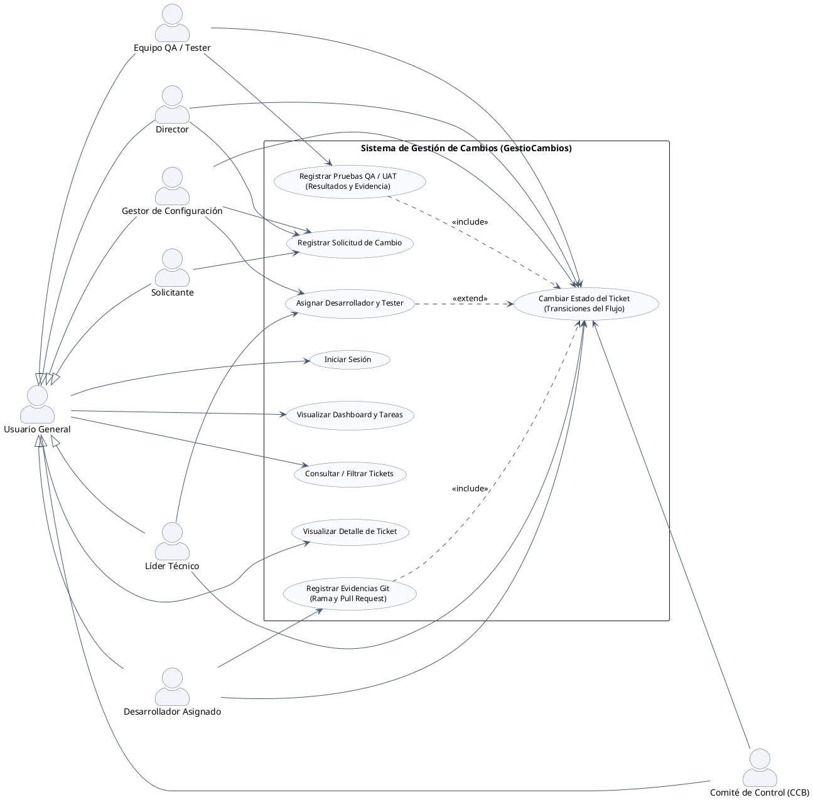

# Diagrama de Casos de Uso - GestioCambios

El diagrama de Casos de Uso define los límites del sistema y detalla las interacciones entre los usuarios (actores) y las funcionalidades que provee el aplicativo de gestión de configuración.

---

## 🎨 1. Diagrama en PlantUML

---

## 📝 2. Descripción de Actores y Casos de Uso

### Actores del Sistema
* **Usuario General (Base):** Actor abstracto que unifica los permisos comunes a todos los usuarios del sistema.
* **Solicitante:** Usuario (ej. Docente Evaluador) que registra la necesidad de cambio en el software.
* **Director:** Responsable de autorizar inicialmente los cambios e integraciones.
* **Gestor de Configuración (SCM):** Administrador del repositorio y estados, encargado de asignar recursos e integrar los cambios liberados.
* **Líder Técnico:** Analista técnico responsable de la viabilidad, estimación y asignación del personal de desarrollo/QA.
* **Comité de Control (CCB):** Entidad colegiada que aprueba o rechaza cambios con impacto mayor en el proyecto.
* **Desarrollador Asignado:** Constructor técnico que modifica los elementos de configuración de software (ECS).
* **Equipo QA / Tester:** Equipo de aseguramiento de calidad encargado de realizar las pruebas unitarias, funcionales (QA) y de aceptación (UAT).

### Casos de Uso Clave
* **Registrar Solicitud de Cambio:** Creación del ticket ingresando justificación e impacto.
* **Asignar Desarrollador y Tester:** Delegación de tareas técnicas a usuarios específicos.
* **Registrar Evidencias Git:** Inyección de la rama de desarrollo y URL del Pull Request, permitiendo la trazabilidad del código.
* **Registrar Pruebas QA / UAT:** Inserción de resultados de pruebas para dar viabilidad a la liberación de código.
* **Cambiar Estado del Ticket:** Operación de flujo SCM regulada por el motor de estados según el perfil.
