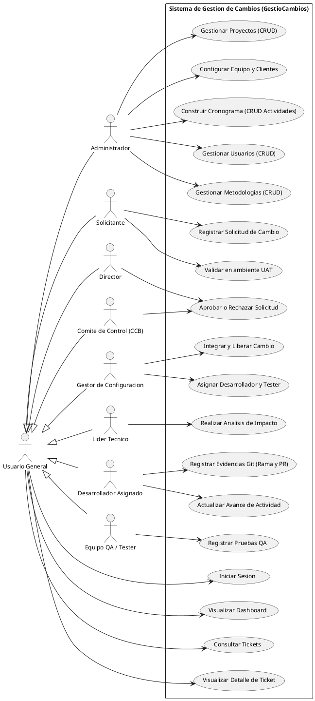

# Diagrama de Casos de Uso - GestioCambios

El diagrama de Casos de Uso define los limites del sistema y detalla las interacciones entre los usuarios (actores) y las funcionalidades que provee el aplicativo de gestion de cambios.

---

## 1. Diagrama en PlantUML

---

## 2. Descripcion de Actores y Casos de Uso

### Actores del Sistema
* **Usuario General:** Actor base que unifica las operaciones de visualizacion, consulta y autenticacion disponibles para todos los perfiles de la aplicacion.
* **Administrador:** Rol global encargado de la gestion inicial de usuarios, definicion de metodologias de trabajo, creacion de proyectos y diseno del cronograma base.
* **Solicitante:** Cliente o usuario que reporta una necesidad de cambio e inicia el ticket SCM. Ademas, valida el resultado en la etapa de pruebas de usuario (UAT).
* **Director:** Autoridad encargada de habilitar el analisis de la solicitud y de aprobar, rechazar o descartar el ticket.
* **Lider Tecnico:** Encargado del analisis de impacto tecnico, estimaciones de esfuerzo, versionado de software e identificacion de elementos de configuracion afectados.
* **Comite de Control (CCB):** Ente encargado de la aprobacion formal y colegiada de las solicitudes de cambio.
* **Gestor de Configuracion:** Rol operativo que asigna al desarrollador y al tester, habilita la fase de construccion, e integra y despliega las versiones finales al liberar el ticket.
* **Desarrollador Asignado:** Tecnico encargado de realizar los cambios, reportar su avance de tareas y registrar evidencias de repositorios Git.
* **Equipo QA / Tester:** Responsable del control de calidad del software mediante pruebas unitarias/funcionales y el pase del ticket a la fase UAT.

### Casos de Uso Principales
* **Gestionar Usuarios, Metodologias y Proyectos:** Operaciones de administracion global reservadas para estructurar la informacion inicial del sistema.
* **Construir Cronograma:** Creacion de actividades vinculadas a fases metodologicas y entregables.
* **Registrar Solicitud de Cambio:** Creacion de la peticion SCM ingresando descripcion, justificacion, tipo e impacto estimado.
* **Realizar Analisis de Impacto:** Estimacion tecnica de horas-hombre y version de afectacion.
* **Aprobar o Rechazar Solicitud:** Autorizacion o desestimacion del cambio por parte del Director o del CCB.
* **Asignar Desarrollador y Tester:** Delegacion de tareas operativas una vez aprobado el cambio.
* **Registrar Evidencias Git:** Vinculacion de ramas de codigo y Pull Requests.
* **Registrar Pruebas QA:** Ejecucion de controles de calidad.
* **Validar en UAT:** Aceptacion final de la modificacion por el Solicitante.
* **Integrar y Liberar Cambio:** Fusion en rama principal (main), despliegue de version y marcado como liberado.
