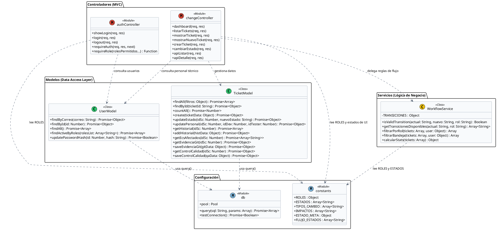

# Diagrama de Clases UML - GestioCambios

El diagrama de clases modela la estructura lógica del backend, definiendo los métodos, atributos y relaciones de los componentes de configuración, controladores, servicios y modelos de datos (patrón 3 capas).

---

## 🎨 1. Diagrama en PlantUML

---

## 📝 2. Descripción de Componentes Claves

* **Capa de Configuración:** 
  * `db.js` maneja la infraestructura técnica de base de datos exponiendo la conexión mediante promesas.
  * `constants.js` declara las constantes y variables paramétricas globales (evitando la duplicidad y el acoplamiento rígido).
* **Capa de Modelos (DAL):** Clases singleton encargadas únicamente de la consulta y mapeo físico relacional con la base de datos de usuarios y tickets de cambio.
* **Capa de Servicios:** `WorkflowService` actúa como el motor de reglas y la máquina de estados. Evalúa si las acciones enviadas por la UI son correctas según las transiciones lógicas del negocio SCM.
* **Capa de Controladores:** Clases encargadas de interactuar con Express.js, extrayendo parámetros de peticiones web y mapeando las respuestas mediante renderizado HTML (EJS) o API REST (JSON).
