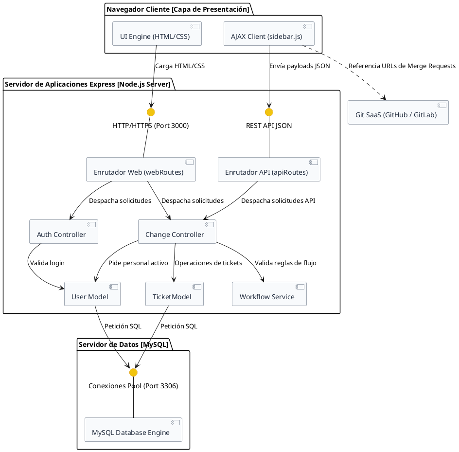

# Diagrama de Componentes - GestioCambios

El diagrama de componentes detalla la organización lógica de los módulos de software en tiempo de ejecución, sus interfaces de comunicación y la distribución de tareas entre el frontend, el backend y la persistencia de datos.

---

## 🎨 1. Diagrama en PlantUML

---

## 📝 2. Especificación de Componentes e Interfaces

### Capa de Cliente (Presentación)
* **UI Engine (HTML5/CSS3):** Encargado de pintar el maquetado dinámico y responder al escalado visual.
* **AJAX Client (`sidebar.js`):** Gestiona la lógica asíncrona del lado del cliente. Escucha eventos, recolecta inputs (como asignados, ramas de Git, evidencias de QA) y realiza peticiones `PUT/POST` en formato JSON para actualizar los tickets sin parpadeos de recarga.

### Capa de Servidor (Negocio y Control)
* **Interfaces HTTP y REST:** Puntos de entrada lógicos expuestos en el puerto `3000`.
* **Enrutadores (`webRoutes` y `apiRoutes`):** Analizan las URLs entrantes y derivan la ejecución al controlador correspondiente.
* **Controladores (`authController` y `changeController`):** Procesan la información de sesión y coordinan las llamadas lógicas.
* **Workflow Service:** Componente lógico que implementa el autómata de estados de cambio de SCM, controlando qué transiciones están permitidas por rol.
* **Capa de Modelos (User y Ticket):** Módulos que encapsulan las sentencias SQL y abstraen las consultas de BD en objetos de negocio legibles.

### Capa de Datos y Servicios Externos
* **MySQL Database Engine (Puerto 3306):** Servidor relacional encargado del resguardo de las tablas físicas del sistema.
* **Git SaaS (GitHub/GitLab):** Servicio externo de administración de código referenciado mediante enlaces HTTP desde el cliente.
