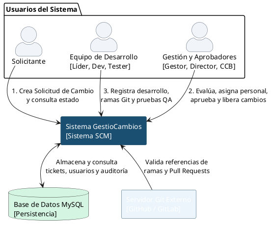

# Diagrama de Contexto - GestioCambios

El diagrama de contexto (Modelo C4 - Nivel 1) provee una vista panorámica de alto nivel que delimita las fronteras del sistema, mostrando las entidades externas (usuarios y sistemas) que se comunican con él.

---

## 🎨 1. Diagrama en PlantUML

---

## 📝 2. Descripción de Interfaces Externas

* **Límite del Sistema (GestioCambios):** El aplicativo web Node.js responsable de coordinar el control de cambios de software.
* **Solicitante (Actor):** Ingresa requerimientos al sistema y monitorea el estado actual.
* **Equipo de Desarrollo (Actor):** Interviene actualizando ramas, asignaciones y registrando resultados de control de calidad técnico.
* **Gestión y Aprobación (Actor):** Director, Gestor SCM o miembros de CCB que evalúan el impacto y deciden el avance del ciclo de vida.
* **Base de Datos MySQL (Sistema Externo):** Persistencia relacional local encargada de resguardar el estado y las credenciales seguras.
* **Servidor Git Externo (GitHub/GitLab):** Infraestructura externa de versionamiento de código. El sistema asocia y enlaza referencias lógicas (ramas y solicitudes de integración) para asegurar la trazabilidad SCM.
