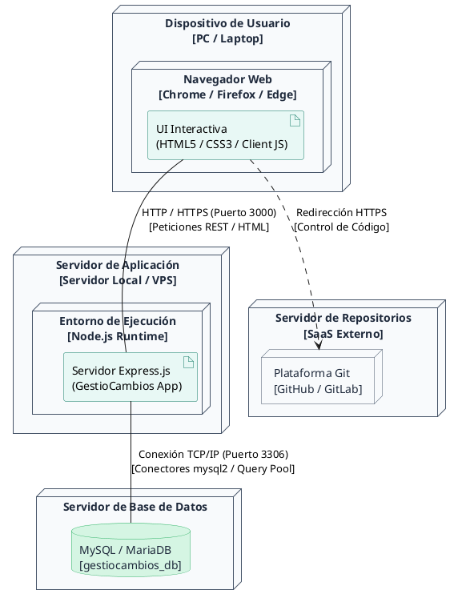

# Diagrama de Despliegue - GestioCambios

El diagrama de despliegue representa la arquitectura física y de red del sistema, detallando el hardware (nodos), el middleware (servidores de aplicación) y las piezas de software (artefactos) que intervienen en la ejecución.

---

## 🎨 1. Diagrama en PlantUML

---

## 📝 2. Descripción de Componentes de Infraestructura

* **Dispositivo de Usuario:** La máquina física del usuario final. Ejecuta el navegador web y procesa los estilos estáticos CSS y los scripts cliente AJAX ([sidebar.js](file:///c:/Users/ASUS/Music/Sistema_de_Gestion_de_la_Configuracion/GestioCambios/public/js/sidebar.js)) para comunicarse con el servidor.
* **Servidor de Aplicación Node.js (Puerto 3000):** El servidor Express.js procesa la lógica en backend y compila dinámicamente las plantillas del lado del servidor (EJS) para retornarlas como HTML al cliente.
* **Servidor de Base de Datos MySQL (Puerto 3306):** Instancia local o remota que almacena la persistencia de datos relacionales, comunicándose a través de sockets TCP/IP con el pool de conexiones del conector `mysql2`.
* **Servidor de Repositorios Git (GitHub/GitLab):** Plataforma externa en la nube a la que el usuario es redirigido desde el navegador para auditar e integrar ramas de código.
