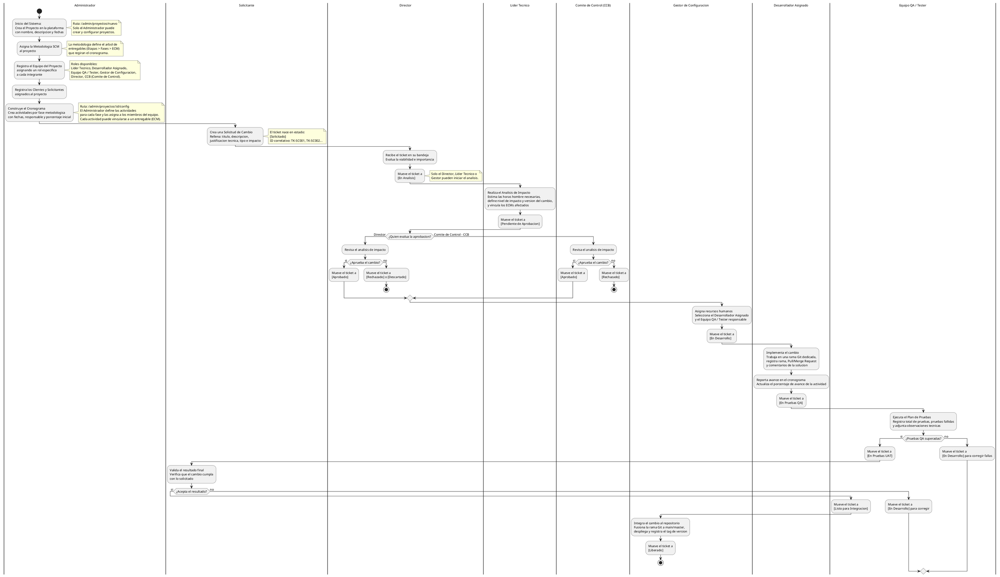

# Diagrama de Flujo de Actores - GestioCambios

Este diagrama muestra la sucesion completa de actores y sus responsabilidades en el ciclo de vida de una Solicitud de Cambio (Ticket SCM), desde la preparacion del proyecto hasta la liberacion final.

---

## Diagrama en PlantUML



---

## Descripcion de los Actores

| Actor | Rol en Sistema | Acciones en el Flujo |
| :--- | :--- | :--- |
| Administrador | Administrador (Global) | Registra el proyecto, equipo, metodologia, construye el cronograma inicial y monitorea notificaciones de la plataforma. |
| Solicitante | Solicitante (Proyecto) | Crea la solicitud de cambio al inicio del flujo y valida el resultado final en pruebas de aceptacion de usuario (UAT). |
| Director | Director (Proyecto) | Evalua viabilidad (de Solicitado a En Analisis), y aprueba, rechaza o descarta el ticket (de Pendiente de Aprobacion a Aprobado/Rechazado/Descartado). |
| Lider Tecnico | Lider Tecnico (Proyecto) | Realiza el analisis de impacto tecnico (estimacion de horas, impacto, version y ECMs), y puede mover de En Desarrollo a En Pruebas QA, y de QA/UAT a Listo para Integracion. |
| Comite de Control (CCB) | CCB (Proyecto) | Evalua de manera colegiada las solicitudes de cambio en la fase de aprobacion formal (de Pendiente de Aprobacion a Aprobado/Rechazado). |
| Gestor de Configuracion | Gestor de Configuracion (Proyecto) | Asigna desarrollador y tester al ticket aprobado, abre la fase de desarrollo, y realiza la integracion, despliegue y liberacion final del cambio. |
| Desarrollador Asignado | Desarrollador (Proyecto) | Desarrolla la solucion, registra la rama Git y Pull/Merge Request, actualiza el avance de la actividad y envia a pruebas. |
| Equipo QA / Tester | Tester (Proyecto) | Disena y ejecuta pruebas de control de calidad, aprueba o rechaza el control de calidad interno, y gestiona el paso del ticket a UAT o su retorno a desarrollo en caso de fallos. |

---

## Estados del Ticket y Transiciones

```
[Solicitado]
    |-- En Analisis                      (Director / Lider Tecnico / Gestor)
            |-- Pendiente de Aprobacion  (Lider Tecnico / Gestor)
                    |-- Rechazado        (Director / CCB)
                    |-- Descartado       (Director)
                    |-- Aprobado         (Director / CCB)
                              |-- En Desarrollo       (Gestor / Desarrollador)
                                        |-- En Pruebas QA     (Desarrollador / Lider Tecnico)
                                                  |-- En Pruebas UAT  (Tester / Lider Tecnico)
                                                  |-- Listo para Integracion (Tester / Lider Tecnico)
                                                            |-- Liberado  (Gestor)
```

Cada transicion queda registrada en el historial de estados de la base de datos, indicando el usuario responsable, fecha/hora, estado previo, estado posterior y el comentario justificativo correspondiente.
