# Diagrama de Paquetes - GestioCambios

El diagrama de paquetes representa la estructura de directorios física y lógica del código fuente de **GestioCambios**, delineando cómo se agrupan los archivos en módulos y las dependencias de importación entre ellos.

---

## 🎨 1. Diagrama en PlantUML

```plantuml
@startuml
skinparam backgroundColor #FFFFFF
skinparam ranksep 50
skinparam nodesep 35

skinparam package {
    BackgroundColor #F8FAFC
    BorderColor #475569
    FontColor #1E293B
}

' 1. RAÍZ DEL PROYECTO
package "Directorio Raíz [/]" as Root {
    rectangle "server.js\n[Punto de entrada]" as ServerJS
    rectangle "hash-passwords.js\n[Migración de claves]" as HashPass
    rectangle "test-app.js\n[Script de pruebas]" as TestApp
    rectangle "bd.sql\n[Script de Base de Datos]" as BDSql
    rectangle ".env\n[Variables de entorno]" as Env
    rectangle ".gitignore" as GitIgnore
    rectangle "package.json\n[Metadatos del proyecto]" as PackageJson
    rectangle "package-lock.json" as PackageLock
    rectangle "README.md\n[Documentación técnica]" as Readme
}

' 2. CAPAS DEL SISTEMA
package "config/" as ConfigFolder {
    rectangle "db.js\n[Pool MySQL]" as DBJs
    rectangle "constants.js\n[Constantes globales]" as ConstJs
    rectangle "db-init.js\n[Inicialización de tablas]" as DBInitJs
}

package "routes/" as RoutesFolder {
    rectangle "webRoutes.js\n[Rutas HTML EJS]" as WebRoutes
    rectangle "apiRoutes.js\n[API REST JSON]" as ApiRoutes
}

package "controllers/" as ControllersFolder {
    rectangle "authController.js\n[Controlador Auth]" as AuthCtrl
    rectangle "changeController.js\n[Controlador SCM]" as ChangeCtrl
}

package "services/" as ServicesFolder {
    rectangle "WorkflowService.js\n[Lógica de estados]" as WorkflowSvc
}

package "models/" as ModelsFolder {
    rectangle "UserModel.js\n[Modelo Usuario]" as UserMdl
    rectangle "TicketModel.js\n[Modelo Ticket]" as TicketMdl
}

package "views/" as ViewsFolder {
    package "partials/" as PartialsFolder {
        rectangle "head.ejs" as HeadEjs
        rectangle "sidebar.ejs" as SidebarEjs
        rectangle "footer.ejs" as FooterEjs
    }
    rectangle "dashboard.ejs" as DashEjs
    rectangle "error.ejs" as ErrEjs
    rectangle "login.ejs" as LoginEjs
    rectangle "nuevo-ticket.ejs" as NuevoEjs
    rectangle "ticket-detail.ejs" as DetailEjs
    rectangle "tickets.ejs" as TicketsEjs
}

package "public/" as PublicFolder {
    package "css/" as CssFolder {
        rectangle "styles.css\n[Estilos visuales]" as StylesCss
    }
    package "js/" as JsFolder {
        rectangle "sidebar.js\n[Lógica AJAX UI]" as SidebarJs
    }
}

package "node_modules/" as NodeModulesFolder {
    rectangle "express\n[Servidor HTTP]" as ExpDep
    rectangle "mysql2\n[Conector DB]" as MysqlDep
    rectangle "bcryptjs\n[Hasheo seguro]" as BcryptDep
    rectangle "ejs\n[Motor vistas]" as EjsDep
}

' RELACIONES DE DEPENDENCIA
ServerJS --> WebRoutes : "importa"
ServerJS --> ApiRoutes : "importa"
ServerJS --> DBInitJs : "ejecuta al arrancar"
ServerJS --> DBJs : "prueba conexión"
ServerJS --> Env : "lee variables"

WebRoutes --> AuthCtrl : "despacha"
WebRoutes --> ChangeCtrl : "despacha"
ApiRoutes --> ChangeCtrl : "despacha"
ApiRoutes --> AuthCtrl : "valida sesión"

AuthCtrl --> UserMdl : "consulta datos"
AuthCtrl --> BcryptDep : "compara hashes"
AuthCtrl --> ConstJs : "lee roles"
AuthCtrl --> LoginEjs : "renderiza"
AuthCtrl --> ErrEjs : "renderiza"

ChangeCtrl --> TicketMdl : "realiza operaciones CRUD"
ChangeCtrl --> UserMdl : "consulta personal activo"
ChangeCtrl --> WorkflowSvc : "valida transiciones"
ChangeCtrl --> ConstJs : "lee roles y estados"
ChangeCtrl --> DashEjs : "renderiza"
ChangeCtrl --> TicketsEjs : "renderiza"
ChangeCtrl --> DetailEjs : "renderiza"
ChangeCtrl --> NuevoEjs : "renderiza"

WorkflowSvc --> ConstJs : "valida"

UserMdl --> DBJs : "ejecuta queries"
TicketMdl --> DBJs : "ejecuta queries"
DBJs --> ConstJs : "importa constants.js"
DBJs --> Env : "configura credenciales"
DBJs --> MysqlDep : "crea pool de conexiones"
DBInitJs --> DBJs : "usa conexión activa"

ViewsFolder ..> PublicFolder : "enlaza recursos"
ViewsFolder ..> PartialsFolder : "incluye componentes comunes"

HashPass --> DBJs : "conecta DB"
HashPass --> BcryptDep : "hashea claves"
TestApp --> ServerJS : "peticiones HTTP"

@enduml
```

---

## 📝 2. Organización del Código y Capas de Acoplamiento

La estructura física del proyecto implementa una **arquitectura en capas altamente desacoplada**:
* **Directorio Raíz (`/`):** Contiene archivos de configuración de infraestructura, metadatos (`package.json`), variables de entorno (`.env`), scripts de inicialización de la BD SQL (`bd.sql`) y scripts auxiliares.
* **Paquete `config/`:** Infraestructura técnica de base de datos e inicialización. Contiene el pool de conexiones y el archivo centralizado de constantes de la lógica.
* **Paquetes de Negocio (`models/`, `services/`, `controllers/` y `routes/`):** Divididos físicamente por su responsabilidad única:
  * Las rutas dirigen las peticiones hacia los controladores.
  * Los controladores consumen modelos para los datos y servicios para evaluar el flujo.
  * Los modelos realizan consultas y retornan registros puros.
* **Paquetes de Interfaz (`views/` y `public/`):** Contienen las vistas HTML dinámicas en EJS y los recursos estáticos vinculados en el navegador del cliente.
