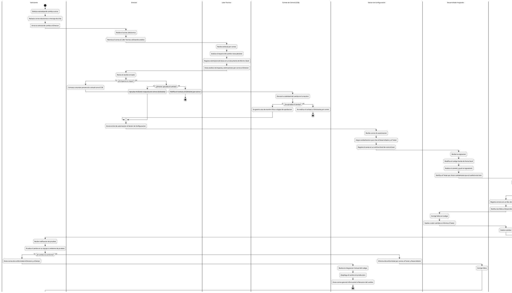

# Diagrama del Proceso Actual (Antes del Sistema SCM)

Este documento detalla el proceso manual, tradicional y no sistematizado de gestion de cambios (proceso AS-IS) que se realizaba mediante correos electronicos, mensajeria de chat, archivos Excel locales y comunicacion verbal, antes de la implementacion del sistema GestioCambios.

---

## 1. Diagrama de Proceso en PlantUML

---

## 2. Puntos Criticos del Proceso Manual (AS-IS)

* **Falta de trazabilidad:** No hay un repositorio centralizado de auditoria. Las conversaciones, justificaciones y aprobaciones quedan dispersas en bandejas de correo individuales o chats temporales.
* **Inexistencia de control de estados:** Los tickets no tienen estados duros y regulados. El avance depende enteramente de que los participantes recuerden enviar un correo o mensaje al siguiente actor en la cadena.
* **Desconexion con el repositorio de codigo:** No hay relacion directa entre la solicitud de cambio y el commit o la rama de desarrollo. El Gestor de Configuracion debe integrar confiando en la palabra del Desarrollador.
* **Control manual de actividades:** El avance del proyecto se gestiona en hojas de Excel locales propensas a errores, duplicaciones y desactualizacion.
* **Dificultad de auditoria:** Para auditar un cambio antiguo, se debe reconstruir la linea de tiempo buscando correos electronicos, actas de reuniones escaneadas e historiales de chat.
