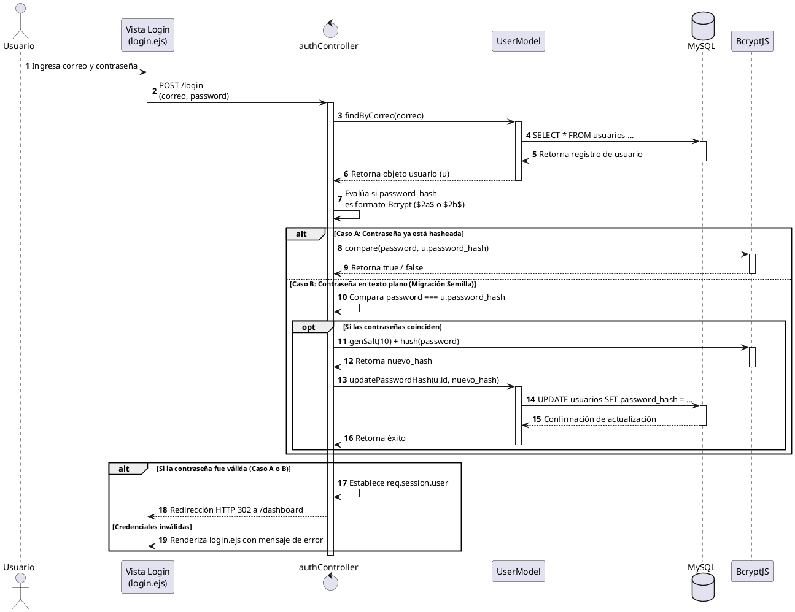
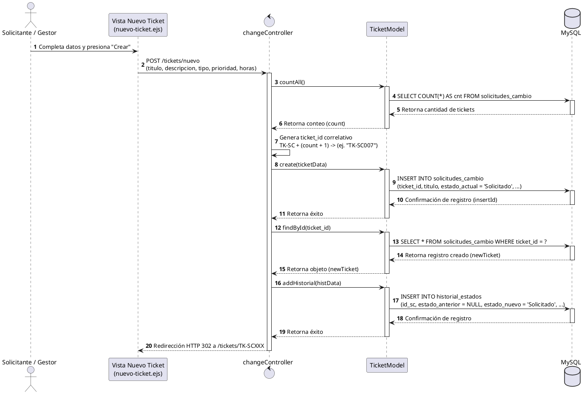
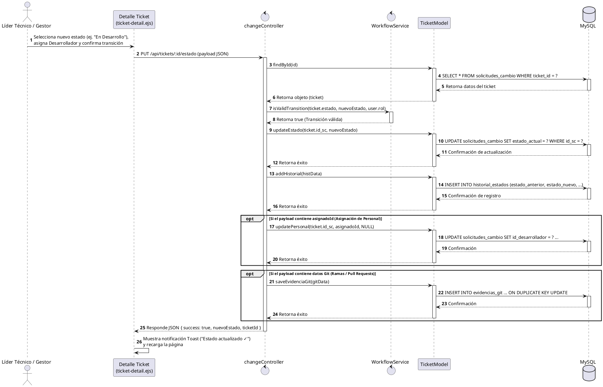

# Diagramas de Secuencia - GestioCambios

Los diagramas de secuencia ilustran la interacción de los componentes del sistema a lo largo del tiempo para ejecutar los tres casos de uso más críticos y representativos de la arquitectura.

---

## 🔐 1. Iniciar Sesión con Hasheo Seguro (Bcrypt)

### Diagrama en PlantUML

### Descripción del Flujo
1. El usuario envía sus credenciales al servidor Express.
2. El controlador `authController` consulta los datos de registro mediante el método `findByCorreo` de `UserModel`.
3. Si el hash guardado posee el prefijo de Bcrypt, se delega la comparación al componente `bcryptjs`.
4. Si la clave se encuentra en texto plano (datos semilla), se evalúa la coincidencia directa. De ser exitosa, se genera el hash correspondiente en tiempo real y se actualiza en la base de datos de manera transparente (*lazy migration*), estableciendo la sesión del usuario.

---

## 📋 2. Registrar Solicitud de Cambio (Ticket)

### Diagrama en PlantUML

### Descripción del Flujo
1. El solicitante registra los parámetros del cambio.
2. `changeController` solicita al `TicketModel` el conteo de elementos registrados para calcular el correlativo único de ticket (ej. `TK-SC004`).
3. Se inserta la solicitud de cambio en la base de datos a través de `TicketModel.create()`.
4. Tras recuperar el identificador autonumérico asignado en BD (`id_sc`), el controlador inserta una entrada en la tabla historial con estado inicial `"Solicitado"`, culminando con el redireccionamiento a la interfaz del ticket.

---

## 🔄 3. Transición de Estado y Asignación de Recursos

### Diagrama en PlantUML

### Descripción del Flujo
1. La interfaz envía una petición asíncrona mediante AJAX al endpoint de estado conteniendo todos los datos del formulario (comentarios, asignados, ramas Git, resultados de pruebas).
2. El controlador valida el estado actual del ticket y consulta las reglas en `WorkflowService` para corroborar que la transición es válida para el rol del usuario autenticado.
3. Si es válida, se actualiza el estado y se registra la transición en la tabla de historial de auditoría.
4. Opcionalmente, se procesa de forma atómica la inserción o actualización de la asignación del desarrollador técnico, rama de Git e información de control de calidad, respondiendo con éxito en formato JSON.
